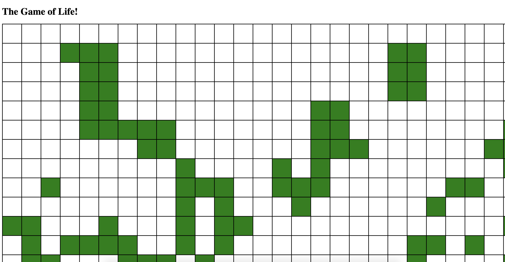

# Conway's Game of Life

Welcome to the README for my rendition of Conway's Game of Life!

Link to Web Deployment: https://shawkitajima.github.io/CodeRetreat-Conways-Game-Of-Life/

## Screenshots

## Technologies Used
- HTML
- CSS
- Javascript
- Mocha/Chai

## Getting Started

This game is fully functional when launched. In fact, the user cannot do anything, as this is a zero player game. All you have to do is watch the pretty shapes that the rules create.

If you are not familiar with the rules. Here they are:
- Any live cell with two or three neighbors survives.
- Any dead cell with three live neighbors becomes a live cell.
- All other live cells die in the next generation. Similarly, all other dead cells stay dead.

## Next Steps

At this time, there are no plans for further work on this project.